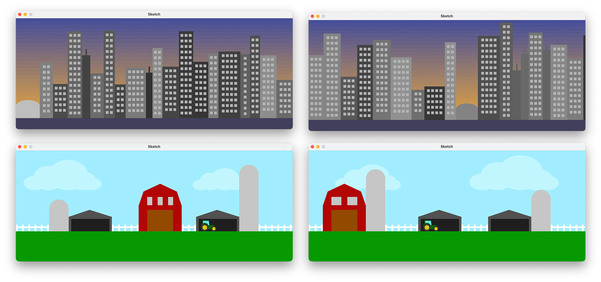

# Procedural Landscape Generator

In this assignment, you will create a **procedurally generated landscape** that looks different every time the program runs.

Your landscape must fill the **entire width of the canvas**, built from many smaller structures placed **end‑to‑end** from left to right.  

This creates a continuous world, be it urban, rural, suburban, industrial, futuristic, or totally fantastical.

To give you some idea, here are a couple examples of procedurally generated landscapes:

  

Note the procedural variation across the structures and how they fit together seamlessly left-to-right. Try not to copy these exactly — be creative and come up with your own designs!

 

## What You Must Build

Your program must generate a **full-width landscape**, made from multiple structures arranged horizontally:

- Your scene must be composed of **repeating structures** drawn *sequentially* from left to right.
- Each structure must be drawn by a **custom method**.
- Each structure must **report how much horizontal space it occupies** so the next structure can be drawn immediately beside it.
- The theme is entirely up to you:
  - **Urban** (buildings, apartments, towers, antennas)
  - **Rural** (barns, silos, windmills, hay bales, fences, trees)
  - **Suburban** (houses, garages, schools, playgrounds)
  - **Industrial** (tanks, pipes, smokestacks, warehouses)
  - **Sci‑fi / Fantasy** (spires, crystal formations, alien flora, hover towers)

Your landscape should feel like one continuous scene, not isolated drawings.

 

## Technical Requirements

### Required Structures
Your landscape must include **at least 3 distinct types of structures**, each with different shapes or visual features.

Examples:
- A barn, a silo, and a windmill  
- A tall building, a dome, and a radio tower  
- A factory, a smokestack, and a warehouse

### Required Methods
Your program must include:

- At least one method with **parameters**  
- At least one method with a **return value**  
- At least one example of **method composition**  

   > *Method composition is when a method calls another method. For example, a method to draw a building might call another method that draws its windows.*

### Code Quality Requirements
Your code must follow the department’s Java [style expectations](https://github.com/SACHSTech/Java-Style-Guide), specifically:

- **Clean, readable formatting**  
  - Proper indentation  
  - Consistent spacing and braces  
- **Self-documenting code**  
  - Clear, descriptive variable and method names  
  - Logic should be readable without needing excessive inline comments  
- **Javadocs where appropriate**  
  - Every *non-trivial* method should have a Javadoc block (`/** ... */`)  
  - Include `@param` and `@return` when the method accepts parameters or returns a value  
  - Small one-liners (like simple helper methods) may use a short description only  
- **No repeated code blocks**  
  - Extract repeated drawing behaviours into helper methods  
- **Keep methods reasonably short**  
  - Each method should do *one job*  
- **Logical organization**  
  - Group related methods together  
  - Use whitespace to make the structure readable  

### Canvas Size
Suggested: **1000 × 400**

You may test other sizes, but your code must fill the screen **horizontally** regardless.

 

## Hint: How to Organize a Procedural Landscape

A procedural landscape is just a series of structures placed side-by-side across the canvas. What matters most is that each structure:

- is drawn using its own method
- can appear as different widths or heights
- fits immediately beside the previous structure
- creates variation each time the program runs

To help you create a continuous landscape, think about the following ideas:

### 1. Structures Need to Know *Where* to Draw
Every structure must start drawing at some x-position.
This means your methods should accept parameters that tell them where they belong.

### 2. Structures Should Tell You *How Wide They Are*
If your structure’s size changes randomly, your program will need to know how wide it ended up being.
This is a meaningful use of a **return value**.

*(You decide how to use that information.)*

### 3. Use Method Composition to Avoid Repetition
A larger structure can be made from smaller helper methods, such as:

- a method that draws windows
- a method that draws a door
- a method that draws a roof

This keeps your code clean and modular.

### 4. Introduce Variation
To make your world procedural, give each structure a bit of randomness:

- colour  
- height  
- width  
- number of features  
- pattern differences  

Even small changes make the output unique each run.

### 5. Fill the Whole Canvas
Your program must generate enough structures to span the entire width. *How* you accomplish this is up to you: loop type, control logic, stopping condition, etc.

 

## Assessment Rubric

| Category | Level 4 | Level 3 | Level 2 | Level 1 |
|--------------|-------------|-------------|-------------|-------------|
| **Learning Objectives**   *Assesses whether all required features of the assignment are present and working ("what you built").* | Landscape fills full width; includes 3+ distinct structure types; strong procedural variation; uses multiple custom methods, including parameter and return-value methods and clear method composition. All required features fully implemented. | Landscape fills width; more than one structure type; procedural generation works; required parameter + return-value methods implemented correctly. | Landscape partially fills width or has limited procedural variety; limited structure types; some required methods missing or incomplete. | Minimal work; landscape does not fill width; major features missing; little or no procedural generation. |
| **Commit History & Workflow**   *Assesses work habits and professionalism using Git, including meaningful commits that show progress over time.* | Frequent, meaningful commits documenting progress; commit messages are professional, specific, and descriptive. | Regular commits showing progress; most messages are descriptive. | Some commits made; messages are brief, generic, or inconsistent. | Few commits or commit messages missing, unclear, or uninformative. |
| **Code Quality & Method Design**   *Assesses how well solution is written: clarity, decomposition, naming, documentation, and adherence to the Java style guide ("how you built it").* | Code is clean and well‑organized; strong method decomposition; clear parameter and return-value usage; excellent naming; appropriate Javadocs; no repeated code; fully follows Java Style Guide. | Code is readable and mostly follows style expectations; methods structured reasonably well; naming is clear; minor duplication or documentation gaps. | Method structure inconsistent; unclear naming; repeated code; weak Javadocs; partial adherence to style guidelines. | Code is messy or difficult to follow; major duplication; unclear logic; poor naming; minimal or no documentation; not aligned with Java style expectations. |

 

## Work Submission
- Complete your code in `src/Sketch.java`.
- Include at least **one screenshot** of a completed run. Upload it to the Google Classroom assignment.
- Push all changes to GitHub Classroom before submitting.

Good luck. This project rewards creativity!
